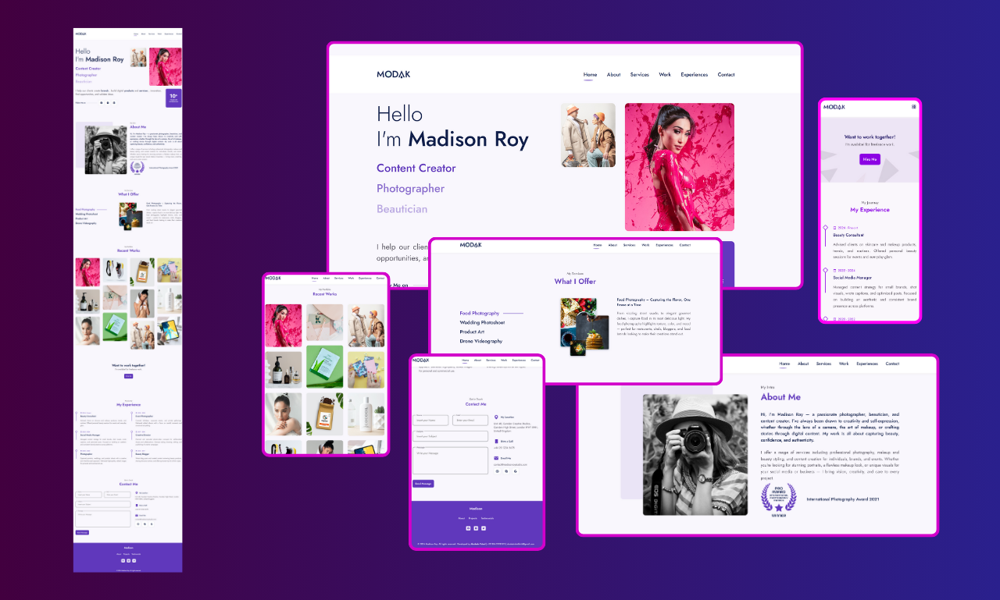

# Portfolio Website - Medison Roy

A modern and responsive portfolio website built using **HTML**, **CSS**, and **JavaScript**, with a working contact form using **FormSubmit**.

## 🔧 Technologies

- HTML5  
- CSS3  
- JavaScript  
- FormSubmit (for contact form handling)

## ✅ Features

- Fully responsive design  
- Clean and minimal layout  
- Home, About, Services, Work, Experience and Contact sections  
- Functional contact form (no backend required)

## 📌 Purpose

This is a practice project created to demonstrate development skills.